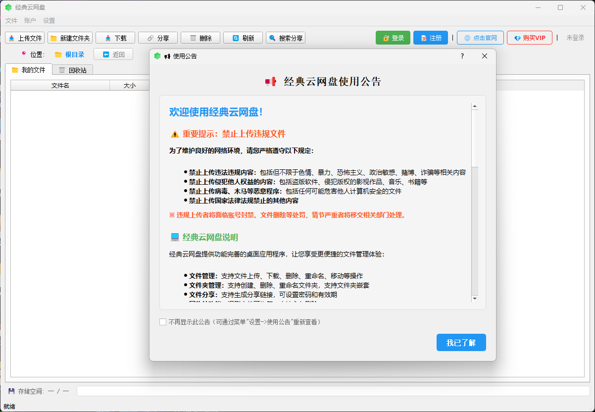

# 经典云网盘

**经典云网盘的官方桌面客户端，与网站数据完全同步**

[下载](#下载) • [功能特性](#功能特性) • [使用说明](#使用说明) • [系统要求](#系统要求) • [常见问题](#常见问题)

---

### 🖼️ 应用程序截图

*经典云网盘主界面*

---

## 📋 简介

经典云网盘程序是一个功能完整的云存储客户端，提供与网站完全一致的用户体验。支持文件上传、下载、管理、分享等完整功能，让您随时随地访问和管理您的云存储文件。

## ✨ 功能特性

### 🔐 用户管理
- ✅ 用户登录/注册（与网站账号同步）
- ✅ 自动保存登录状态
- ✅ 安全的Token验证机制

### 📁 文件管理
- ✅ 文件列表查看（支持文件夹导航）
- ✅ 文件上传（支持大文件、多文件上传）
- ✅ 文件下载（支持断点续传）
- ✅ 文件删除/恢复
- ✅ 回收站管理（恢复、永久删除）
- ✅ 文件搜索功能
- ✅ 文件描述编辑

### 📂 文件夹管理
- ✅ 创建文件夹
- ✅ 文件夹导航（面包屑导航）
- ✅ 文件夹分享

### 🔗 文件分享
- ✅ 生成分享链接
- ✅ 分享链接管理（查看、复制、删除）
- ✅ 搜索分享链接并下载
- ✅ 支持分享链接自动识别（从URL提取分享码）

### 💾 存储管理
- ✅ 存储空间统计（已用/总容量）
- ✅ 存储空间进度条显示
- ✅ VIP会员存储空间管理
- ✅ 下载次数实时显示（与官网一致）

### 🔄 数据同步
- ✅ 与网站数据实时同步
- ✅ 文件列表自动刷新
- ✅ 下载次数实时更新

## 💻 系统要求

### Windows
- Windows 7 / 8 / 8.1 / 10 / 11
- Windows Server 2012 R2 及以上版本
- 支持 32位 和 64位 系统

### Linux
- Ubuntu 18.04 及以上版本
- Debian 9 及以上版本
- CentOS 7 及以上版本
- 其他基于 glibc 的 Linux 发行版
- 支持 x86_64 和 ARM64 架构

### macOS
- macOS 10.12 (Sierra) 及以上版本
- macOS 11 (Big Sur) 及以上版本
- macOS 12 (Monterey) 及以上版本
- macOS 13 (Ventura) 及以上版本
- macOS 14 (Sonoma) 及以上版本
- 支持 Intel 和 Apple Silicon (M1/M2/M3) 芯片

## 🚀 快速开始

1. **下载应用程序**
   - 从 [Releases](https://github.com/xuanxuan205/Classic-cloud-network-disk/releases/tag/V1.0.0) 页面下载对应平台版本

2. **运行应用程序**
   - Windows: 双击 `经典云网盘.exe`
   - Linux: 运行 `./经典云网盘`
   - macOS: 双击 `经典云网盘.app`

3. **登录账号**
   - 点击"登录"按钮
   - 输入您的用户名和密码
   - 如果没有账号，点击"注册"创建新账号

4. **开始使用**
   - 上传文件：点击"上传文件"按钮
   - 下载文件：双击文件或点击"下载"按钮
   - 管理文件：使用工具栏的各种功能按钮

## 📖 使用说明

### 文件上传
1. 点击工具栏"上传文件"按钮
2. 选择要上传的文件（支持多选）
3. 文件会自动上传到当前文件夹

### 文件下载
1. 在文件列表中选中文件
2. 点击工具栏"下载"按钮
3. 或双击文件进行下载
4. 选择保存位置

### 文件管理
- **创建文件夹**：点击"新建文件夹"按钮
- **进入文件夹**：双击文件夹或点击"打开"按钮
- **删除文件**：选中文件后点击"删除"按钮
- **恢复文件**：在回收站中选中文件，点击"恢复"按钮

### 文件分享
1. 选中文件或文件夹
2. 点击"分享"按钮
3. 复制分享链接
4. 管理分享：点击文件列表中的🔗图标

### 搜索分享链接
1. 点击工具栏"搜索分享"按钮
2. 输入分享链接或分享码
3. 支持自动识别URL中的分享码
4. 查看分享信息并下载文件

## ⚙️ 配置说明

### 配置文件位置
- **Windows**: `C:\Users\用户名\.classic_cloud\config.json`
- **Linux/macOS**: `~/.classic_cloud/config.json`

### 日志文件位置
- **所有平台**: `~/.classic_cloud/logs/app_YYYYMMDD.log`

## ❓ 常见问题

### 无法登录
- 检查网络连接
- 检查API地址是否正确
- 检查用户名和密码是否正确
- 查看日志文件获取详细错误信息

### 上传失败
- 检查文件大小是否超过限制
- 检查存储空间是否充足
- 检查网络连接稳定性

### 下载失败
- 检查网络连接
- 检查下载路径是否有写入权限
- 检查磁盘空间是否充足

### 应用程序无法启动
- 检查系统要求是否满足
- 查看日志文件获取错误信息
- 尝试以管理员权限运行（Windows）

## 🔒 隐私与安全

- 所有数据传输使用 HTTPS 加密
- Token 自动加密存储
- 配置文件仅所有者可访问
- 不收集任何用户隐私信息

## 📝 更新日志

详见 [CHANGELOG.md](CHANGELOG.md)

## 🤝 贡献

欢迎提交 Issue 和 Pull Request！

## 📄 许可证

本项目采用 [MIT License](LICENSE) 许可证。

## 📞 技术支持

- **QQ**: 2080341475
- **邮箱**: 2080341475@qq.com
- **技术支持时间**: 工作日 8:00-22:00

## 🌐 相关链接

- [官方网站](https://gta5fuzhup.cn)
- [问题反馈](https://github.com/your-username/classic-cloud-desktop/issues)
- [功能建议](https://github.com/your-username/classic-cloud-desktop/issues)

---

**经典云网盘桌面应用程序** © 2025

Made with ❤️ by Classic Cloud Team

